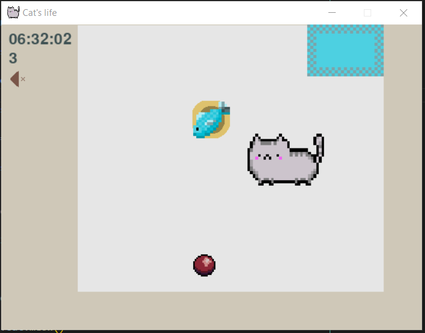
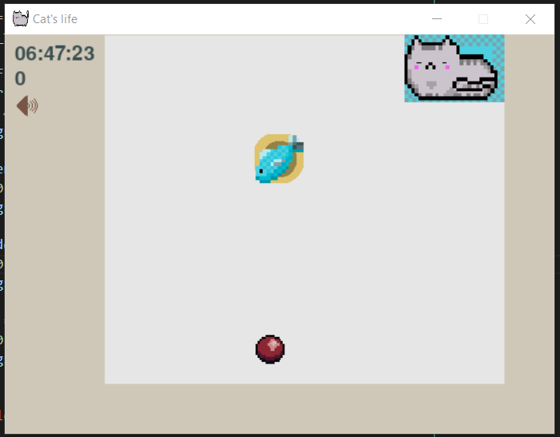

  

  

<h1>Simple cat's life</h1>
It's the simplest imitation of a cat's life. 
Cat can sleep, eat, play with the ball. 
 

 

 

 

<h3>Controls:</h3> 
1. LEFT, UP, DOWN, RIGH arrow keys -  
&nbsp&nbsp&nbsp&nbspto move the cat. 
2. SPACE - to eat fish OR to go to sleep  
&nbsp&nbsp&nbsp&nbsp(depends on if the cat is near the bed or  
&nbsp&nbsp&nbsp&nbspthe plate). 
3. M - muting the meow sound. 
4. A, W, S or D - to kick the ball LEFT, UP, 
&nbsp&nbsp&nbsp&nbspDOWN or RIGHT
 
 
Cat starts random roaming after 10 seconds 
of not pressing LEFT, UP, DOWN, RIGHT 
arrow keys.